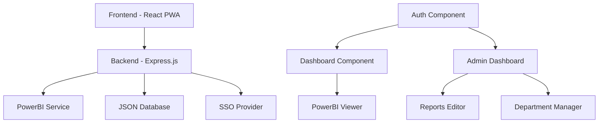
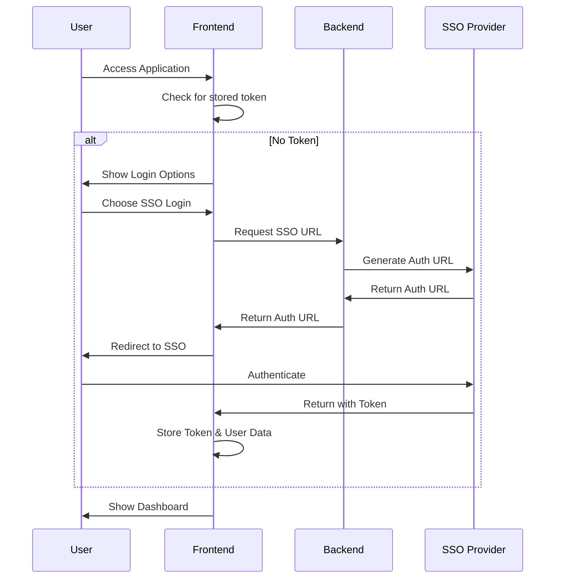
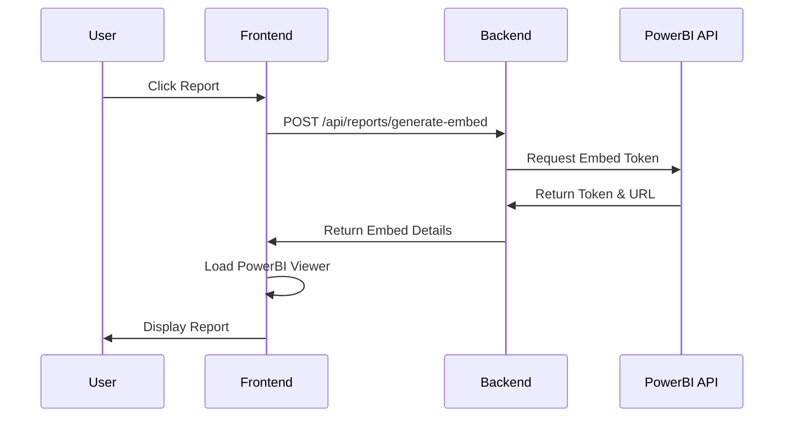

# Business Portal - PowerBI Dashboard Application

A comprehensive business intelligence portal built with React and TypeScript, featuring PowerBI integration, department-based access control, and admin management tools.

## 🏗️ Architecture Overview



## 📁 Project Structure

### Frontend (React PWA)
```
src/
├── components/           # React components
│   ├── AuthComponent.tsx        # Authentication interface
│   ├── Dashboard.tsx           # Main user dashboard
│   ├── AdminDashboard.tsx      # Admin management interface
│   ├── PowerBIViewer.tsx       # PowerBI report viewer
│   ├── AdminReportsEditor.tsx  # Admin report management
│   ├── AdminDepartmentManager.tsx # Department management
│   ├── AdminReportsViewer.tsx  # Admin report viewer
│   ├── ReportIcon.tsx          # Report icon mapper
│   └── powerbi/
│       └── PowerBIEmbed.tsx    # PowerBI embedding logic
├── config/
│   └── api.ts                  # API endpoint configuration
├── hooks/
│   └── useReports.ts          # Reports data fetching hook
├── lib/
│   ├── auth.ts                # Authentication utilities
│   └── utils.ts               # General utilities
├── pages/
│   ├── Index.tsx              # Main application entry
│   └── NotFound.tsx           # 404 error page
└── index.css                  # Global styles
```

### Backend (Express.js)
```
auth-server/
├── server.ts              # Main server file
├── reports-data.json      # Reports and departments database
└── package.json          # Server dependencies
```

## 🔄 Application Flow

### Authentication Flow


### PowerBI Report Access Flow


## 📋 File Documentation

### Core Components

#### `src/components/AuthComponent.tsx`
**Purpose**: Handles user authentication with SSO and manual login options
- **Features**: 
  - SSO authentication via URL token
  - Manual admin login with email/password
  - Automatic token validation and storage
- **State Management**: Login type, form data, loading states
- **Integration**: Communicates with backend auth endpoints

#### `src/components/Dashboard.tsx`
**Purpose**: Main user dashboard displaying available reports
- **Features**:
  - Department-specific report filtering
  - Dynamic PowerBI embed token generation
  - Report statistics display
  - Fullscreen report viewing
- **Data Flow**: Fetches reports → Generates embed tokens → Displays PowerBI reports
- **Security**: JWT-based authentication for all API calls

#### `src/components/AdminDashboard.tsx`
**Purpose**: Administrative interface for system management
- **Features**:
  - System statistics overview
  - Tabbed interface for different admin functions
  - Reports, departments, and user management
- **Access Control**: Admin-only access with role validation

#### `src/components/PowerBIViewer.tsx`
**Purpose**: Embedded PowerBI report viewer with controls
- **Features**:
  - Responsive report embedding
  - Fullscreen functionality using browser APIs
  - Navigation controls
- **Integration**: Uses PowerBI JavaScript SDK for embedding

#### `src/components/AdminReportsEditor.tsx`
**Purpose**: Admin interface for managing PowerBI reports
- **Features**:
  - CRUD operations for reports
  - Automatic embed token generation on save
  - Department assignment
  - Report activation/deactivation
- **Validation**: Ensures all PowerBI IDs are present before token generation

### Configuration Files

#### `src/config/api.ts`
**Purpose**: Centralized API endpoint configuration
- **Endpoints**:
  - Authentication endpoints
  - Report management endpoints
  - PowerBI embed generation endpoints
  - Admin-specific endpoints

#### `auth-server/server.ts`
**Purpose**: Express.js backend server with authentication and PowerBI integration
- **Features**:
  - JWT-based authentication
  - SSO integration
  - PowerBI embed token generation
  - CRUD API for reports and departments
  - Rate limiting for security
- **Security**: 
  - JWT verification middleware
  - CORS configuration
  - Input validation
  - Rate limiting on sensitive endpoints

### Data Management

#### `auth-server/reports-data.json`
**Purpose**: JSON-based database for reports and departments
- **Structure**:
  ```json
  {
    "reports": [
      {
        "id": "unique-id",
        "title": "Report Name",
        "department": "Department Name",
        "reportId": "powerbi-report-id",
        "datasetId": "powerbi-dataset-id",
        "coreDatasetId": "powerbi-core-dataset-id",
        "embedToken": "generated-token",
        "embedUrl": "generated-url",
        "isActive": true
      }
    ],
    "departments": ["HR", "Finance", "Sales"]
  }
  ```

## 🔐 Security Features

### Authentication
- **JWT Tokens**: Secure token-based authentication
- **SSO Integration**: Enterprise single sign-on support
- **Role-based Access**: Admin vs regular user permissions
- **Token Expiration**: Automatic token refresh handling

### API Security
- **Rate Limiting**: Prevents abuse of PowerBI embed generation
- **Input Validation**: Sanitizes all user inputs
- **CORS Protection**: Configured cross-origin resource sharing
- **Authorization Headers**: Bearer token authentication

### PowerBI Security
- **Dynamic Tokens**: Fresh embed tokens generated per session
- **Scoped Access**: Department-based report filtering
- **Token Expiration**: Short-lived PowerBI tokens for security

## 🚀 Deployment

### Development Setup
1. **Install Dependencies**:
   ```bash
   npm install
   cd auth-server && npm install
   ```

2. **Environment Configuration**:
   - Set PowerBI credentials in backend
   - Configure SSO provider settings
   - Set JWT secret keys

3. **Start Development Servers**:
   ```bash
   # Frontend
   npm run dev
   
   # Backend
   cd auth-server && npm start
   ```

### Production Deployment
- **Frontend**: Built as PWA for offline capability
- **Backend**: Express.js server with production optimizations
- **Database**: JSON file storage (can be migrated to SQL/NoSQL)
- **PowerBI**: Enterprise PowerBI workspace integration

## 🔧 Configuration

### PowerBI Setup
1. Register application in Azure AD
2. Configure PowerBI workspace permissions
3. Set up service principal authentication
4. Configure embed settings in PowerBI admin portal

### SSO Configuration
1. Set up OAuth provider (Azure AD, Google, etc.)
2. Configure redirect URIs
3. Set up client credentials
4. Configure user claim mapping

## 📊 Features

### User Features
- **Department Dashboard**: Personalized report access
- **Responsive Design**: Mobile-friendly interface
- **Offline Support**: PWA capabilities
- **Fullscreen Viewing**: Immersive report experience

### Admin Features
- **Report Management**: Add, edit, and organize reports
- **Department Management**: Create and manage departments
- **User Analytics**: Track system usage
- **PowerBI Integration**: Automated embed token management

## 🛠️ Technical Stack

- **Frontend**: React 18, TypeScript, Bootstrap, Vite
- **Backend**: Node.js, Express.js, JWT
- **PowerBI**: PowerBI JavaScript SDK
- **Authentication**: SSO + Manual login
- **Styling**: Bootstrap + Custom CSS
- **Icons**: Lucide React
- **State Management**: React hooks + localStorage

## 📈 Performance Optimizations

- **Code Splitting**: Dynamic imports for components
- **Token Caching**: Efficient PowerBI token management  
- **Rate Limiting**: Prevents API abuse
- **Responsive Loading**: Progressive loading states
- **Error Boundaries**: Graceful error handling

## 🐛 Troubleshooting

### Common Issues
1. **PowerBI Reports Not Loading**: Check embed tokens and URLs
2. **Authentication Failures**: Verify JWT configuration
3. **CORS Errors**: Configure backend CORS settings
4. **SSO Redirect Issues**: Check redirect URI configuration

### Debug Mode
- Enable console logging in development
- Check network requests in browser dev tools
- Verify JWT token payload and expiration
- Test PowerBI embed URLs directly

This documentation provides a comprehensive overview of the Business Portal application architecture, components, and functionality.
